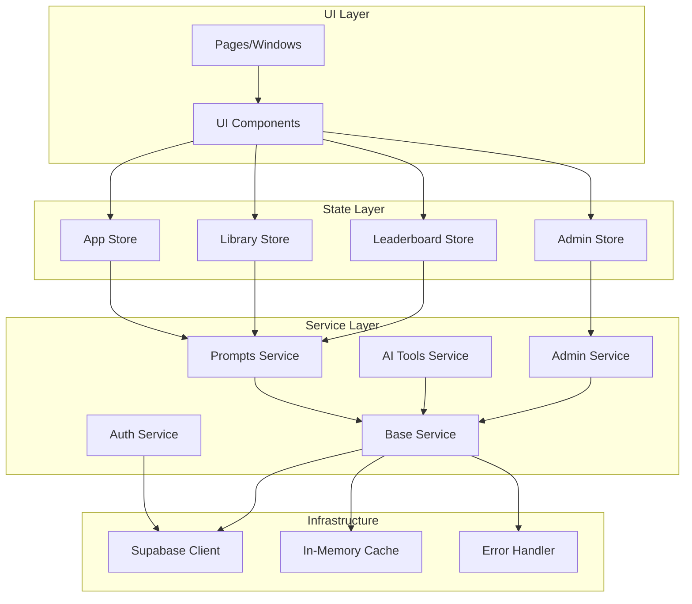

# Stanford Prompt Library - Architecture Documentation

## Overview

The Stanford Prompt Library is a web application for discovering, submitting, and sharing AI prompts. The architecture follows a **layered service pattern** with centralized state management, providing a clean separation of concerns.

## System Architecture



## Core Layers

### 1. UI Layer (`src/pages/`, `src/components/`)

**Purpose**: Renders the user interface and handles user interactions.

**Structure**:
```
src/
├── pages/
│   ├── discover.js       # Browse prompts
│   ├── submit.js         # Submit new prompts
│   ├── leaderboard.js    # User rankings
│   ├── admin.js          # Admin panel
│   └── error.js          # Error pages
├── components/
│   ├── navbar.js         # Navigation
│   ├── footer.js         # Footer
│   └── cards/            # Reusable cards
```

**Responsibilities**:
- Render UI based on state
- Handle user events (clicks, form submissions)
- Subscribe to store changes
- Dispatch state updates

**Example**:
```javascript
// Page subscribes to store
libraryStore.subscribe(['filteredPrompts'], (state) => {
  renderPrompts(state.filteredPrompts)
})

// Page calls service
async function loadPrompts() {
  const prompts = await getApprovedPrompts()
  libraryStore.setState({ allPrompts: prompts }, 'discover-page')
}
```

### 2. State Layer (`src/state/`)

**Purpose**: Manages application-wide state with pub/sub pattern.

**Architecture**:
```javascript
class Store {
  state = {}           // Current state
  listeners = Map()    // Subscribers
  middlewares = []     // State change interceptors
  history = []         // State change history
}
```

**Stores**:
- **appStore**: User auth, theme, app-wide settings
- **libraryStore**: Prompts data, filters, search
- **leaderboardStore**: User rankings, votes
- **adminStore**: Admin panel state

**Features**:
- **Nested paths**: `getState('user.profile.name')`
- **Selective subscriptions**: `subscribe(['count', 'user'], callback)`
- **Wildcard subscriptions**: `subscribe('*', callback)`
- **Middleware**: Logger, persistence, validation
- **History tracking**: Undo/redo capability

**Example**:
```javascript
// Subscribe to specific keys
const unsubscribe = libraryStore.subscribe(['searchQuery', 'currentCategory'], (state, prevState, changedKeys) => {
  console.log('Search changed:', state.searchQuery)
  filterPrompts(state)
})

// Update state
libraryStore.setState({
  searchQuery: 'python',
  currentCategory: 'coding'
}, 'search-input')

// Clean up
unsubscribe()
```

### 3. Service Layer (`src/services/`)

**Purpose**: Business logic and data fetching with standardized error handling and caching.

**Hierarchy**:
```
BaseService (abstract)
├── PromptsService
├── AIToolsService
└── AdminService

AuthService (standalone)
```

**BaseService Features**:

1. **Standardized Error Handling**
   ```javascript
   class DatabaseError extends Error {
     constructor(message, code, details) {
       super(message)
       this.code = code
       this.details = details
     }
   }
   ```

2. **Automatic Caching**
   ```javascript
   async getApprovedPrompts() {
     return this.getCached('approved', async () => {
       return this.executeQuery(() =>
         supabase.from('prompts').select('*')
       )
     }, CACHE_TTL.MEDIUM)
   }
   ```

3. **Pattern-Based Cache Invalidation**
   ```javascript
   // Invalidate all user-related caches
   this.invalidateCache('user:')
   ```

4. **Metrics Tracking**
   ```javascript
   {
     requests: 150,
     errors: 2,
     cacheHits: 87,
     cacheMisses: 63
   }
   ```

5. **Request Deduplication**
   ```javascript
   // Multiple simultaneous requests → single database call
   Promise.all([
     service.getApprovedPrompts(),
     service.getApprovedPrompts(),
     service.getApprovedPrompts()
   ]) // Only 1 DB query
   ```

**Service Example**:
```javascript
export class PromptsService extends BaseService {
  constructor() {
    super('prompts', {
      cacheTTL: CACHE_TTL.MEDIUM,
      enableMetrics: true
    })
  }

  async submitPrompt(promptData, imageFile) {
    const user = await getCurrentUser()
    if (!user) throw new AuthenticationError()

    const validation = validatePrompt(promptData)
    if (!validation.valid) {
      throw new ValidationError('Invalid prompt', validation.errors)
    }

    return await this.executeMutation(
      () => supabase.from('prompts').insert([promptData]),
      ['approved', `user:${user.id}`] // Invalidate these caches
    )
  }
}
```

### 4. Infrastructure Layer

#### Supabase Client (`src/config/supabase.js`)

**Purpose**: Database, authentication, and storage.

```javascript
export const supabase = createClient(SUPABASE_URL, SUPABASE_ANON_KEY)
```

**Tables**:
- `prompts`: User-submitted prompts
- `ai_tools`: AI tool submissions
- `users`: User profiles
- `likes`: Prompt likes
- `categories`: Prompt categories

#### Cache System (`BaseService`)

**Purpose**: In-memory caching to reduce database load.

**Features**:
- TTL-based expiration
- Pattern-based invalidation
- Size limits (LRU eviction)
- Hit/miss metrics

**Configuration**:
```javascript
CACHE_TTL = {
  SHORT: 30000,   // 30 seconds
  MEDIUM: 300000, // 5 minutes
  LONG: 900000    // 15 minutes
}
```

## Data Flow

### Loading Prompts (Read Operation)

```
1. User visits Discover page
   ↓
2. Page calls getApprovedPrompts()
   ↓
3. Service checks cache
   ├─ Cache hit → return cached data
   └─ Cache miss → continue
   ↓
4. Service executes Supabase query
   ↓
5. Service unwraps {data, error} response
   ├─ Error → throw DatabaseError
   └─ Success → continue
   ↓
6. Service caches result
   ↓
7. Service returns data to page
   ↓
8. Page updates libraryStore
   ↓
9. Store notifies subscribers
   ↓
10. UI re-renders with new data
```

### Submitting Prompt (Write Operation)

```
1. User fills submit form
   ↓
2. User clicks "Submit"
   ↓
3. Page calls submitPrompt(data)
   ↓
4. Service validates authentication
   ├─ Not logged in → throw AuthenticationError
   └─ Logged in → continue
   ↓
5. Service validates prompt data
   ├─ Invalid → throw ValidationError
   └─ Valid → continue
   ↓
6. Service uploads image (if provided)
   ↓
7. Service inserts prompt to database
   ↓
8. Service invalidates caches:
   - 'approved' (all prompts)
   - 'user:{userId}' (user's prompts)
   ↓
9. Service returns success response
   ↓
10. Page shows success message
    ↓
11. Page redirects to My Prompts
```

## Error Handling Strategy

### Error Types

```javascript
DatabaseError        // Database/Supabase errors
ServiceError         // Service layer errors
ValidationError      // Data validation errors
AuthenticationError  // Auth failures
```

### Error Propagation

```
Database Error
  ↓
BaseService.executeQuery()
  ↓ (wraps as DatabaseError)
PromptsService.submitPrompt()
  ↓ (adds context)
UI Component
  ↓ (shows error message)
User
```

### Error Handling Example

```javascript
try {
  await promptsService.submitPrompt(data)
  showSuccess('Prompt submitted!')
} catch (error) {
  if (error instanceof ValidationError) {
    showErrors(error.errors)
  } else if (error instanceof AuthenticationError) {
    redirectToLogin()
  } else if (error instanceof DatabaseError) {
    showError(`Database error: ${error.message}`)
    logError(error)
  } else {
    showError('An unexpected error occurred')
  }
}
```

## State Management Patterns

### 1. Centralized State

All app state lives in stores:
```javascript
// ❌ Don't: Component-local state
let currentUser = null

// ✅ Do: Centralized in store
appStore.setState({ user: userData }, 'auth')
```

### 2. Subscribe-Update Pattern

```javascript
// Subscribe to changes
const unsubscribe = store.subscribe(['key1', 'key2'], (state) => {
  updateUI(state)
})

// Update state
store.setState({ key1: 'new value' }, 'source')

// Clean up
unsubscribe()
```

### 3. Middleware for Cross-Cutting Concerns

```javascript
// Logger middleware
const loggerMiddleware = ({ store, prevState, nextState, source, changedKeys }) => {
  console.log(`[${store}] ${source}:`, changedKeys)
}

appStore.use(loggerMiddleware)

// Persistence middleware
const persistenceMiddleware = ({ store, nextState, changedKeys }) => {
  if (changedKeys.includes('theme')) {
    localStorage.setItem('theme', nextState.theme)
  }
}

appStore.use(persistenceMiddleware)
```

## Caching Strategy

### Cache Levels

1. **Service-level cache** (in-memory, TTL-based)
2. **Browser cache** (HTTP headers)
3. **Supabase cache** (automatic)

### Cache Keys

```
Pattern: {resource}:{identifier}

Examples:
- 'approved' → all approved prompts
- 'user:123' → prompts by user 123
- 'prompt:456' → single prompt 456
- 'leaderboard:10' → top 10 users
```

### Cache Invalidation

```javascript
// Specific key
service.invalidateCache('prompt:123')

// Pattern-based (all keys starting with 'user:')
service.invalidateCache('user:')

// Clear all
service.invalidateCache()
```

## Performance Optimizations

### 1. Request Deduplication

Prevents multiple identical requests:
```javascript
// All three calls → single DB query
Promise.all([
  service.getPromptById('123'),
  service.getPromptById('123'),
  service.getPromptById('123')
])
```

### 2. Selective Re-rendering

Only re-render on relevant changes:
```javascript
// Only re-render when searchQuery or category changes
store.subscribe(['searchQuery', 'currentCategory'], render)
```

### 3. Lazy Loading

Load data only when needed:
```javascript
// Load details only when user clicks
async function showPromptDetails(id) {
  const prompt = await getPromptById(id)
  renderDetails(prompt)
}
```

## Security Considerations

### 1. Authentication

```javascript
// All sensitive operations check auth
const user = await getCurrentUser()
if (!user) throw new AuthenticationError()
```

### 2. Row-Level Security (RLS)

Supabase policies enforce permissions:
```sql
CREATE POLICY "Users can only update own prompts"
ON prompts FOR UPDATE
USING (auth.uid() = user_id);
```

### 3. Input Validation

```javascript
const validation = validatePrompt(data)
if (!validation.valid) {
  throw new ValidationError('Invalid data', validation.errors)
}
```

### 4. XSS Prevention

```javascript
// ❌ Dangerous
element.innerHTML = userInput

// ✅ Safe
element.textContent = userInput
```

## Testing Strategy

### Unit Tests

- **BaseService**: Caching, error handling, metrics
- **Store**: State management, subscriptions, middleware
- **Coverage**: 64.75% overall, 55% BaseService, 74% Store

### Integration Tests

- Service + BaseService interaction
- Store + middleware integration

### What We Don't Test

- UI components (too brittle)
- Third-party libraries
- Configuration files

## Deployment Architecture

```
GitHub Repository
    ↓
GitHub Actions (CI/CD)
    ↓
Build Process
    ├─ Run tests
    ├─ Run linters
    └─ Build production bundle
    ↓
Vercel/Netlify (Hosting)
    ↓
CDN Distribution
    ↓
Users
```

## File Structure

```
app/
├── src/
│   ├── config/
│   │   ├── supabase.js        # Supabase client
│   │   └── constants.js       # App constants
│   ├── services/
│   │   ├── base-service.js    # Base service class
│   │   ├── prompts.js         # Prompts service
│   │   ├── ai-tools.js        # AI tools service
│   │   ├── admin.js           # Admin service
│   │   └── auth.js            # Auth service
│   ├── state/
│   │   └── store.js           # State management
│   ├── pages/
│   │   ├── discover.js
│   │   ├── submit.js
│   │   ├── leaderboard.js
│   │   └── admin.js
│   └── components/
│       ├── navbar.js
│       └── footer.js
├── tests/
│   ├── setup.js
│   ├── services/
│   │   └── base-service.test.js
│   └── state/
│       └── store.test.js
└── vitest.config.js
```

## Design Decisions

### Why Service Layer?

- **Separation of concerns**: Business logic separate from UI
- **Reusability**: Services used by multiple pages
- **Testability**: Easy to unit test
- **Consistency**: Standardized error handling and caching

### Why Centralized State?

- **Single source of truth**: Avoid state synchronization issues
- **Predictability**: State changes are traceable
- **Debugging**: History tracking and middleware
- **Scalability**: Easy to add new state slices

### Why In-Memory Caching?

- **Performance**: Instant cache hits
- **Simplicity**: No external dependencies
- **Control**: Fine-grained cache invalidation
- **Cost**: Free (no Redis/Memcached needed)

## Future Enhancements

### Potential Improvements

1. **Offline Support**: Service workers, IndexedDB
2. **Real-time Updates**: Supabase subscriptions
3. **Advanced Caching**: Redis for shared cache
4. **GraphQL**: Replace REST with GraphQL
5. **Server-Side Rendering**: Next.js migration
6. **Progressive Web App**: PWA features

### Scaling Considerations

- **Database**: Add read replicas
- **Cache**: Shared Redis cache
- **CDN**: Aggressive caching
- **API**: Rate limiting, pagination

---

**Last Updated**: 2025-11-29
**Version**: 2.0 (Post-Refactoring)
